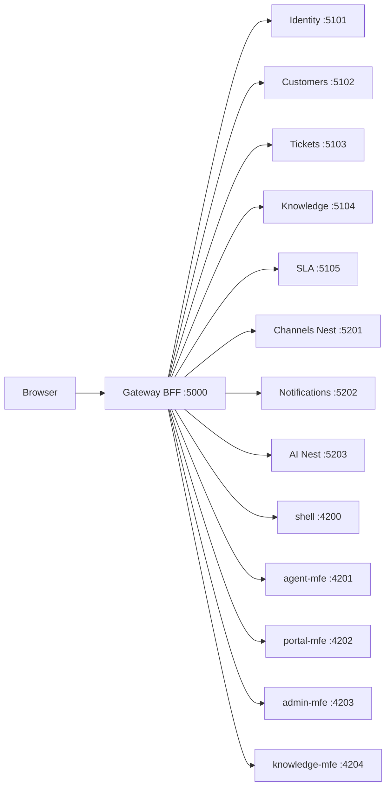

# Customer Support CRM

Spec-driven polyglot microservices + Angular Native Federation micro-frontends.

Give support agents one place to know the customer, work tickets, and reply on the channel the customer used (Arabic or English). Customers submit and track requests in a portal.

| | |
|---|---|
| **Public edge** | `http://localhost:5000` only |
| **Stories** | `CRM-001`…`CRM-044` — see [specs/STORIES.md](specs/STORIES.md) |
| **Product backlog of slices** | [specs/000-product/spec.md](specs/000-product/spec.md) |
| **Deep HLD** | [docs/hld-report.md](docs/hld-report.md) · [docs/architecture.md](docs/architecture.md) |
| **UAT script** | [docs/uat-scenario.md](docs/uat-scenario.md) |

---

## High-level design

### Style

- **Polyglot microservices** — .NET 9 for domain APIs; NestJS for channels, notifications, and AI
- **BFF gateway** — YARP reverse proxy + cookie session (browser never holds API access tokens)
- **Micro-frontends** — Angular Native Federation; remotes loaded through the gateway
- **Patterns** — Vertical slice architecture, in-process CQRS, DDD aggregates per service
- **Delivery** — Spec-driven development under `specs/NNN-slug` with story id `CRM-nnn` on code/tests

### Topology

Agents, customers, and admins use the Angular shell. The **gateway is the only public edge**: it holds the BFF cookie and proxies APIs + MFE remotes. Downstream services stay on private ports.



### Non-negotiable constraints

1. **Spec before code** ([specs/WORKFLOW.md](specs/WORKFLOW.md))
2. Gateway is the **only** public edge
3. Each service owns its data (no shared business DB)
4. Vertical slice + CQRS + DDD
5. MFEs call `/api/...` on the gateway only — never downstream ports
6. Arabic (RTL) + English (LTR) must keep working

### Backend catalog

| Service | Runtime | Port | Owns |
|---|---|---|---|
| Gateway | .NET YARP BFF | 5000 | Cookie session, reverse proxy, external API surface |
| Identity | .NET | 5101 | Users, roles, permissions, settings, audit, branding |
| Customers | .NET | 5102 | Profiles, contacts, notes, attachments |
| Tickets | .NET | 5103 | Lifecycle, tasks, notes, CSAT, reports, ERP outbox |
| Knowledge | .NET | 5104 | FAQ / Article / Solution / Guide + search |
| SLA | .NET | 5105 | Response/resolution policies, auto-assign, escalation |
| Channels | NestJS | 5201 | Email, WhatsApp, live chat, SMS, web-form intake/reply |
| Notifications | NestJS | 5202 | In-app notification inbox |
| AI | NestJS | 5203 | Summaries, suggestions, categorize, portal chatbot |

### Frontend catalog

| App | Port | Gateway path | Owns |
|---|---|---|---|
| shell | 4200 | `/` | Chrome, AR/EN, auth, remote host |
| agent-mfe | 4201 | `/mfe/agent/` | Agent workspace, tickets, customers |
| portal-mfe | 4202 | `/mfe/portal/` | Submit/track, FAQs, CSAT, assistant |
| admin-mfe | 4203 | `/mfe/admin/` | Users, roles, settings, reports |
| knowledge-mfe | 4204 | `/mfe/knowledge/` | Article authoring / search |

Frontend layout is **feature-based + signals** (`api` / `models` / `store` / pages). Prefer separate `.ts` + `.html` + `.scss`. Do not add NgRx for new features.

### Key flows (summary)

**Sign-in (BFF):** Browser → `POST /login` on gateway → Identity validates → httpOnly cookie → `/api/*` forwarded with `X-Crm-User-*` headers.

**Omnichannel:** Channels intake creates/updates a ticket; agents reply on Email / WhatsApp / SMS / Live chat from ticket Messaging; Twilio/SendGrid adapters are env-gated (dev stubs by default).

For full HLD (features by epic, persistence, integrations), see [docs/hld-report.md](docs/hld-report.md).

---

## Spec-driven design (how we build)

Every story moves through the same stages. Specs, plans, code comments, and tests must name the **story id** (`CRM-nnn`) and the spec folder. Full detail: [specs/WORKFLOW.md](specs/WORKFLOW.md).

### Stages

| Stage | Meaning | Exit criteria |
|---|---|---|
| **Specify** | Finish `spec.md` (persona, screens, AC) | Reviewer can demo from the spec alone |
| **Plan** | Write `plan.md` (files, APIs, risks) | Implementable file list |
| **Tasks** (optional) | Break into `tasks.md` | Ordered checklist |
| **Apply** | Implement the plan | Code cites `CRM-nnn` |
| **Test** | Automated tests + gateway smoke | Traits / suites pass |
| **Mock** | Seed / demo data | Screen clickable without extra setup |
| **Done** | Spec status Implemented | Story closed |

Do **not** skip Specify. Do **not** mark Done without Test and a Mock path.

### Spec folder layout

```
specs/
  WORKFLOW.md              ← this process
  STORIES.md               ← CRM-nnn index
  000-product/spec.md      ← product north star + shipped slices
  NNN-slug/
    spec.md                ← contract (required)
    plan.md                ← technical plan
    tasks.md               ← optional task breakdown
    README.md              ← ops / smoke notes (when useful)
```

Active slice pointer (for Cursor skills): `.specify/feature.json` → `feature_directory`.

### Cursor Speckit skills (in-repo)

Use these from Cursor when working a slice:

| Skill | When |
|---|---|
| `speckit-specify` | New feature / “specify” |
| `speckit-clarify` | Spec has NEEDS CLARIFICATION |
| `speckit-plan` | After specify / “plan” |
| `speckit-tasks` | Large plans → `tasks.md` |
| `speckit-implement` | “implement” / build next slice |
| `speckit-converge` | Verify codebase vs spec; append remaining tasks |

### Code citation pattern

```csharp
/// <summary>SDD CRM-001 / specs/002-customer-profiles.</summary>
```

Angular / Nest use the same ids in a file header or `/** SDD CRM-nnn */` comment. Tests use `[Trait("Story", "CRM-001")]` (or equivalent).

---

## Quick start

### Prerequisites

- .NET 9 SDK
- Node.js 20+ (npm)
- SQL Server available locally (Identity/Customers/Tickets) — see `specs/006-data-platform`
- Optional: Postgres for Channels TypeORM (`CHANNELS_DATABASE_URL`)
- Optional: Twilio / SendGrid env for live SMS/WhatsApp/email ([`.env.example`](.env.example))

### Run the full stack

```powershell
powershell -NoProfile -ExecutionPolicy Bypass -File scripts/dev.ps1
```

Wait ~1–2 minutes, then open [http://localhost:5000](http://localhost:5000) (always use the **gateway**, not shell `:4200` alone — MFE remotes load via the gateway).

Verify remotes: `powershell -File scripts/preflight.ps1`

### Frontend unit tests

```bash
cd src/frontend
npm run test:ci    # shared + shell + portal (headless)
```

| Role | Email | Password |
|---|---|---|
| Agent | `agent@crm.local` | `Crm!123` |
| Admin | `admin@crm.local` | `Crm!123` |
| Customer | `customer@crm.local` | `Crm!123` |

Health: [http://localhost:5000/health](http://localhost:5000/health)

Copy `.env.example` → `.env` for local secrets (never commit `.env`). Restart **Channels** after changing Twilio vars.

### Repo map

```
src/
  gateway/                 ← BFF :5000
  services/                ← Identity, Customers, Tickets, Knowledge, SLA, Channels, Notifications, AI
  frontend/                ← shell + MFEs
  building-blocks/         ← shared .NET helpers
specs/                     ← SDD contracts
docs/                      ← architecture + HLD + UAT
scripts/dev.ps1            ← start everything
scripts/preflight.ps1      ← verify gateway + MFE remotes
```

---

## Further reading

- [docs/architecture.md](docs/architecture.md) — living architecture notes
- [docs/hld-report.md](docs/hld-report.md) — high-level design report
- [docs/uat-scenario.md](docs/uat-scenario.md) — end-to-end UAT checklist
- [specs/WORKFLOW.md](specs/WORKFLOW.md) — SDD stages
- [specs/000-product/spec.md](specs/000-product/spec.md) — product north star & shipped slices
- Channel providers (Twilio/SendGrid): [specs/016-channel-providers/README.md](specs/016-channel-providers/README.md) (also [005-channels/016-channel-providers](specs/005-channels/016-channel-providers/README.md))
- Inbound webhooks: [specs/024-inbound-webhooks/README.md](specs/024-inbound-webhooks/README.md) (also [005-channels/024-inbound-webhooks](specs/005-channels/024-inbound-webhooks/README.md))
