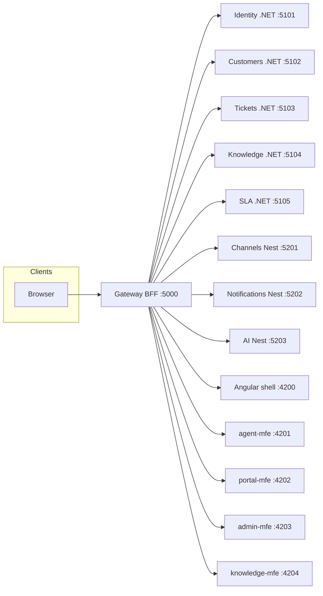
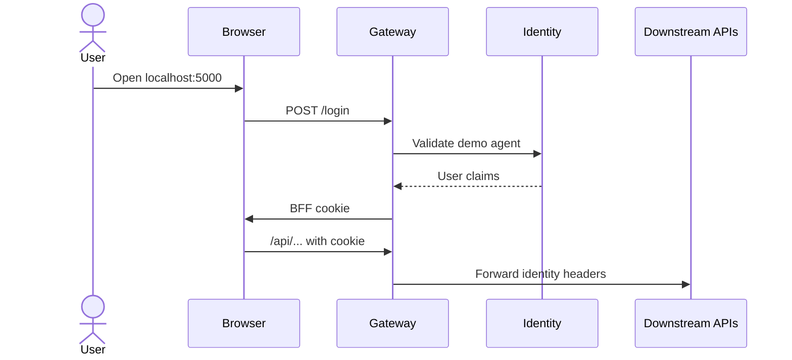

# Customer Support CRM architecture

Living summary of the system. Specs under `specs/` are the review surface.

## Goal

A customer support CRM for agents, customers, and administrators: one customer record, ticket lifecycle, omnichannel intake, knowledge, SLA, and a bilingual web UI. Backend is polyglot (.NET for domain services, NestJS for channels / AI / realtime). Frontend is Angular Native Federation micro-frontends. Patterns: vertical slice architecture, in-process CQRS, DDD aggregates.

## High-level view

Agents, customers, and admins use the Angular shell. The gateway is the only public edge: it holds the BFF cookie session and proxies APIs and MFE remotes. Downstream services stay on private ports.



Knowledge, SLA, and AI are named here for ownership. Slice `001-platform-foundation` does not run those APIs.

## Technical flow

### 1. Sign in (platform stub until CRM-035)



The browser never stores an access token. Full OIDC and role administration are CRM-035.

### 2. Command vs query

Agents mutate through commands (POST/PUT/PATCH/DELETE) handled in a feature folder. Reads go through queries (GET). Each service owns its aggregate. Cross-service work uses contracts, not shared databases.

### 3. Micro-frontends

The shell loads remotes at runtime (Native Federation). Remotes are served through the gateway under `/mfe/{name}/`. Each MFE calls `/api/...` only.

Frontend code inside each MFE is **feature-based + signals**:

```
features/tickets/
  data-access/   tickets.api.ts, tickets.store.ts (signals)
  pages/         list/create/detail smart containers
  ui/            presentational components (inputs/outputs)
  tickets.routes.ts
```

Pages load/query through the store; mutations go through command APIs and then refresh signal state. Do not add NgRx for new features.

## Service catalog

| Service | Runtime | Port | Owns | First stories |
|---|---|---|---|---|
| Gateway | .NET YARP BFF | 5000 | Cookie session, reverse proxy | 001 |
| Identity | .NET | 5101 | Users, roles, config, audit | CRM-035…037 |
| Customers | .NET | 5102 | Profiles, contacts, notes | CRM-001…003 |
| Tickets | .NET | 5103 | Ticket lifecycle | CRM-004…007 |
| Knowledge | .NET | 5104 | Articles | CRM-021…022 |
| SLA | .NET | 5105 | Policies, timers | CRM-017…019 |
| Channels | NestJS | 5201 | Email, WhatsApp, chat, SMS, forms | CRM-008…012 |
| Notifications | NestJS | 5202 | In-app alerts | CRM-020 |
| AI | NestJS | 5203 | Summaries, suggestions, chatbot | CRM-023…026 |

## Frontend catalog

| App | Port (private) | Gateway path | Owns |
|---|---|---|---|
| shell | 4200 | `/` | Chrome, AR/EN, auth, routing |
| agent-mfe | 4201 | `/mfe/agent/` | Agent workspace (CRM-013) |
| portal-mfe | 4202 | `/mfe/portal/` | Customer portal |
| admin-mfe | 4203 | `/mfe/admin/` | Users, config, reports |
| knowledge-mfe | 4204 | `/mfe/knowledge/` | Article authoring/search |

## Next specs (not implemented here)

Knowledge, SLA, and AI folders stay empty until their spec. After 001: **002 Customers** → **003 Tickets** → **004 Identity**.
