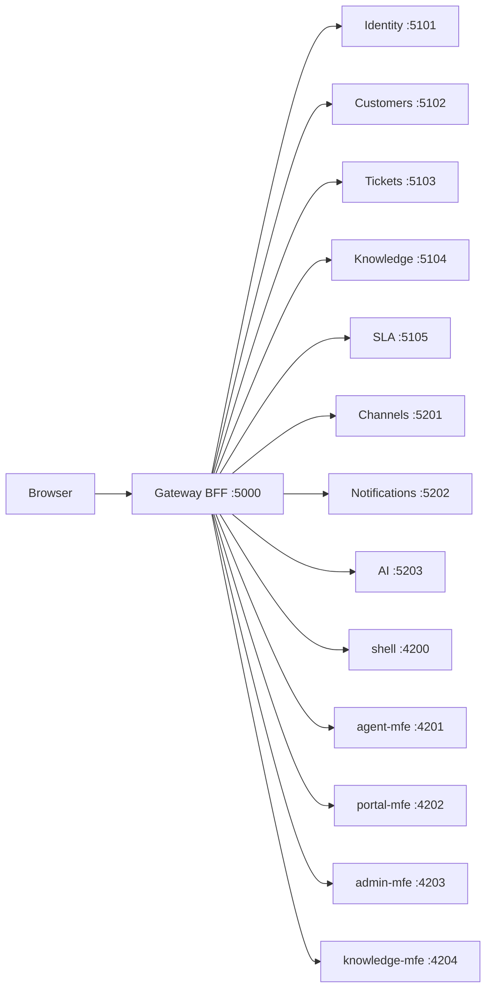

# Customer Support CRM — High-Level Design Report

**Status**: Shipped product snapshot  
**Date**: 2026-08-25  
**Scope**: CRM-001…044 (imported backlog) + polish/deferred specs 041–048  

---

## 1. Executive summary

Customer Support CRM is a polyglot microservices product that gives support agents one place to know the customer, work tickets, and reply on the channel the customer used (Arabic or English), while customers submit and track requests in a portal.

| Metric | Value |
|---|---|
| Story IDs | CRM-001 … CRM-044 |
| Spec slices | 001–048 (Implemented) |
| Backend services | 9 (Gateway + 5 .NET + 3 NestJS) |
| Frontend apps | 5 (shell + 4 Native Federation MFEs) |
| Public edge | `http://localhost:5000` only |
| Demo users | `agent@crm.local` / `admin@crm.local` — password `Crm!123` |

---

## 2. North star & personas

**North star:** One agent workspace with customer context + omnichannel reply; bilingual UI; customer portal for submit/track/FAQs/CSAT.

| Persona | Goals |
|---|---|
| Support agent | Assigned tickets, customer profile, channel reply, AI assist |
| Team lead / manager | Assign work, SLA/CSAT dashboards |
| Customer | Portal submit/track, FAQs, feedback, AI assistant |
| Administrator | Users/roles, settings, audit, branding, ERP |
| Knowledge author | Author FAQs/articles; search |

---

## 3. Architecture overview

### 3.1 Style

- **Polyglot microservices** — .NET for core domain; NestJS for channels, notifications, AI  
- **BFF gateway** — YARP reverse proxy + cookie session (browser never holds access tokens for API calls)  
- **Micro-frontends** — Angular Native Federation; remotes via gateway `/mfe/{name}/`  
- **Patterns** — Vertical slice architecture, in-process CQRS, DDD aggregates per service  
- **Delivery** — Spec-driven development (`specs/NNN-slug`); story id `CRM-nnn` on code/tests  

### 3.2 Topology

### 3.3 Non-negotiable constraints (constitution)

1. Spec before code  
2. Gateway is the only public edge  
3. Own data in the owning service (no shared DB)  
4. Vertical slice + CQRS + DDD  
5. MFEs call `/api/...` on the gateway only  
6. Arabic (RTL) + English (LTR) shell must keep working  

---

## 4. Service catalog

| Service | Runtime | Port | Owns |
|---|---|---|---|
| Gateway | .NET YARP BFF | 5000 | Cookie session, reverse proxy, `/api/external/v1` |
| Identity | .NET | 5101 | Users, roles, permissions, settings, audit, branding, departments |
| Customers | .NET | 5102 | Profiles, contacts, notes, attachments, timeline |
| Tickets | .NET | 5103 | Lifecycle, tasks, notes, CSAT, reports, ERP webhook/outbox |
| Knowledge | .NET | 5104 | FAQ/Article/Solution/Guide authoring + search |
| SLA | .NET | 5105 | Response/resolution policies, auto-assign, escalation |
| Channels | NestJS | 5201 | Email, WhatsApp, live chat, SMS, web-form intake/reply |
| Notifications | NestJS | 5202 | In-app notification inbox |
| AI | NestJS | 5203 | Summaries (SSE), suggestions, categorize, portal chatbot |

**Persistence (local/CI):** SQL Server (Identity/Customers/Tickets path), PostgreSQL (Channels TypeORM), Mongo available via Docker (`006-data-platform`). Sqlite/JSON escape hatches for offline tests.

---

## 5. Frontend catalog

| App | Port | Gateway path | Owns |
|---|---|---|---|
| shell | 4200 | `/` | Chrome, language, auth, remote host |
| agent-mfe | 4201 | `/mfe/agent/` | Agent workspace, tickets, customers |
| portal-mfe | 4202 | `/mfe/portal/` | Submit/track, FAQs, CSAT, AI assistant |
| admin-mfe | 4203 | `/mfe/admin/` | Users, roles, settings, reports, ERP outbox |
| knowledge-mfe | 4204 | `/mfe/knowledge/` | Article authoring/search |

Frontend structure: **Feature-Based + Signals** (`features/{feature}/{use-case}/` with page.ts + html + scss; feature `api` / `models` / `store` / `routes`). No NgRx for new work.

---

## 6. Main features (by epic)

| Area | Stories | Capabilities |
|---|---|---|
| Platform & UX | CRM-041…044 | Bilingual UI, responsive shell, departments/branches, branding |
| Customers | CRM-001…003 | Profiles, contacts, interaction history/notes/attachments |
| Tickets | CRM-004…007 | Create/track, classify, assign, status/escalation/history |
| Channels | CRM-008…012 | Email, WhatsApp, live chat, SMS, web form (+ provider adapters) |
| Agent workspace | CRM-013…016 | My tickets + customer context, tasks, quick replies, notes/@mentions |
| SLA & automation | CRM-017…020 | SLA targets, auto-assign, escalation rules, in-app alerts |
| Knowledge | CRM-021…022 | Author FAQs/articles; ranked search |
| AI | CRM-023…026 | Summaries (persist + stream), suggested replies, auto-categorize, portal chatbot (durable session + handoff) |
| Portal | CRM-027…030 | Submit/track, FAQs, CSAT |
| Reports | CRM-031…034 | Ticket volume, SLA/agent performance, CSAT aggregates, KPI dashboard |
| Security & admin | CRM-035…037 | Users/roles/permissions, audit logs, system config |
| Integrations | CRM-038…040 | External machine API (+ OpenAPI/Swagger), ERP webhook (retries, auth, outbox), channel providers |

---

## 7. Key flows

### 7.1 Authentication (BFF)

1. Browser → `POST /login` on gateway  
2. Gateway → Identity validates credentials  
3. Gateway sets httpOnly session cookies  
4. Subsequent `/api/*` calls use cookie; gateway forwards `X-Crm-User-*` headers  

### 7.2 Omnichannel ticket

1. Intake via Channels (email / WhatsApp / chat / SMS / web form)  
2. Find-or-create Customer + create Ticket  
3. Agent works ticket in agent-mfe with customer summary  
4. Outbound reply on the same channel provider  

### 7.3 External systems

- **Machine API:** `/api/external/v1/*` with `X-Api-Key` (or `Authorization: ApiKey …`)  
- **Docs:** `/api/external/v1/openapi.yaml` and Swagger UI `/api/external/v1/docs`  
- **ERP:** On ticket create, best-effort POST with optional Authorization header, up to 2 retries, durable delivery outbox visible in admin settings  

### 7.4 AI assist

- Agent: generate streaming summary (SSE), suggestions, categorize  
- Portal: FAQ-backed chatbot with durable multi-turn memory and human-handoff CTA  

---

## 8. Cross-cutting design decisions

| Topic | Decision |
|---|---|
| API edge | Gateway only; no public microservice ports |
| Auth for browsers | BFF cookie (not SPA-held access token) |
| Auth for machines | Static API key on external v1 |
| CQRS | In-process (MediatR / Nest CQRS); no message broker required |
| FE state | Angular signals + feature stores |
| i18n | Shell AR (RTL) / EN (LTR) |
| Specs as SoT | If it is not in `spec.md`, it is not required |

---

## 9. Delivery & quality

- **Workflow:** Specify → Plan → Implement → Test → PR (`cursor/<slug>-NNN`) into Azure DevOps  
- **Traceability:** Tests use `[Trait("Story", "CRM-nnn")]` / Nest `describe('CRM-nnn …')`  
- **Review surface:** `specs/` + constitution (`.specify/memory/constitution.md`)  

---

## 10. References

| Document | Path |
|---|---|
| Living architecture | `docs/architecture.md` |
| Product backlog / shipped | `specs/000-product/spec.md` |
| Story catalog | `specs/STORIES.md` |
| Constitution | `.specify/memory/constitution.md` |
| Feature specs | `specs/001-*` … `specs/048-*` |

---

*End of report.*
